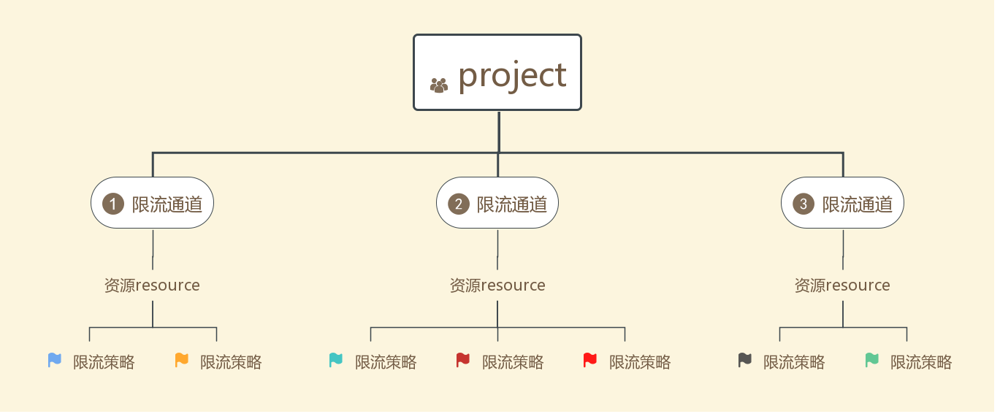

#限流系统-Tap
	一个灵活的限流系统，可根据需要扩展丰富功能，支持基本的单机限流
 * 更简单、灵活的限流系统
 * 支持动态打开关闭、更改限流策略，即时更改，即时生效
 * 支持单机限流：限频、限QPS、黑名单、白名单、百分比
 * > 集群需要使用Redis，暂无实现（支持集群限流：限频、限QPS、限额）

# 整体设计
##基本概念
| 系统概念   |      名称      |  具体描述 |
| :--------: |:-------------- |:------ |
| channel | 限流通道| 一个业务系统分为多个channel，一个channel可以多个strategy.<br/>业务系统对某个具体的资源进行限流，会根据当前资源找到对应的chennel，然后执行channel下的限流策略strategy，如果有一个strategy限制了请求，则整个channel限制请求 |
| resource | 资源 | `channel下面的一个属性，用于channel的区分。两种类型
1、url-pattern类型：必须以/开头，主要应用于url匹配，如对http请求，比如/** 表示所有的URL， 可以支持：？匹配一个字、*匹配0个或多个字符、* *匹配0个或多个目录，于springMVC的url匹配模式一致，主要用于url限流方式 
2、key类型:不以/开头，只匹配一个，主要应用于具体的某个resource，常用于注解方式` |
|strategy|限流策略|具体的限流方式，如限额、限频、黑白名单等等。。。|
##系统设计


以web系统为例：

​       系统对3类接口进行限流，用户/user/**、订单/order/**、支付/pay/**，则需要建立3个channel。

​       对各个channel可以制定限流策略，限流策略可以是多个


# 配置文件

基于以上设计，得出tap的配置文件，JSON格式。

```json
{
//项目
"name":"${name}",
//3个限流通道
"channels":{
		[
			// 资源为/user/**的限流通道
			{
				"resource":"/user/**",
				"strategies":[
					{QPS限流策略},
					{限流策略2},
					...,
					{限流策略N}
				]
			},
			// 资源为/order/**的限流通道
			{"resource":"/order/**","strategies":{[{限频策略1},{限流策略2},...,{限流策略N}]}}
			// 资源为/pay/**的限流通道
			{"resource":"/user/**","strategies":{[{限额策略1},{限流策略2},...,{限流策略N}]}}
		]
	}
}
```

# 接入指南

1、根据自己业务特点生成配置文件

| 字段 | 父级 | 类型   | 值   | 描述                             |
| ---- | ---- | ------ | ---- | -------------------------------- |
| name |      | string |      | 主要用于二次校验，防止配置错误 |
| enable |      | boolean | true/false | 项目总开关                   |
| gatedIps |      | string |      | 灰度发布的ip,多个以英文逗号分隔，如果为空，则表示全部打开 |
| channels |      | json数组  | []     | channel数组 |
| channel |   channels   | json类型  |     {} | channel信息 |
| resource |   channel   | string |      | 一组资源可以是以/开头的url,也可以是具体的字符串<br/>以/开头的url，支持匹配，符合springmvc的路径匹配<br/>普通字符串，在对应具体resource时使用equal的方式 |
| enable |   channel   | boolean |      | channel开关 |
| strategies |  channel    | json数组 |   []   | channel限流策略数组 |
| strategy |   strategies   | json类型 |    {}  | strategy信息 |
| strategyClassName |  strategy    | string |      | className |
| config |  strategy    | string |      | 限流策略具体配置 |

配置文件详解：
```json
{
  "name": "test.tap", ## 项目名称
  "enable":true, ## 项目总开开关
  "gateIps":"172.18.183.29", ##灰度发布的ipv4地址，多个以英文逗号分隔，如果为空则表示日志
  "channels":[  ## 限流通道
    {
      "resource":"/**",  ## 通道/** resource
      "enable":true,	 ## 通道开关
      "strategies":[     ## 通道限流策略
        {
		   ##策略类名  
          "strategyClassName":"com.github.wwjwell.tap.strategy.cluster.ClusterFrequencyStrategy",
           ##策略配置
          "config":{
			## 具体该策略值配置
            "interval": 200
          }
        },
		{
  			"strategyClassName":"com.github.wwjwell.tap.strategy.cluster.ClusterQuotaStrategy",
  			"config":{
    			"key": "uid",
    			"period": 20,
    			"quota":10
  			}
		}
      ]
    }
  ]
}
```

2、Spring配置

```xml
<!-- 系统以及初始化redisStoreClient，可以直接注入 -->
<bean id="tapContext" class="com.github.wwjwell.tap.spring.TapContext">
    <property name="configLocation" value="config_Frequency.json"/>
 </bean>
 
```

3、普通方式使用

```java
/** 使用系统的redisStoreClient */
Tap tap = new Tap.Builder()
    .configLocation("/config_Frequency.json")
    .build();

```

# 限流策略

## 单机-限频

* 描述：单机限制每次请求间隔不小于某个值

* 适用场景：下单、秒杀抢购等场景

* 提示: 由于使用本地LRU缓存，如果在配置时间间隔内 比如说24*3600*1000（一天），导致系统缓存存储超过10万个 key的请求，系统为了防止OOM，会删除最早的key，这样会影响这部分key的限流

* strategyClassName:"com.github.wwjwell.tap.strategy.local.FrequencyStrategy"

* 配置描述：

  | 字段                 | 含义                         | 是否必须 | 默认值 | 描述                                                         |
  | -------------------- | ---------------------------- | -------- | ------ | ------------------------------------------------------------ |
  | key                  | attachment的key              | 否       | 无     | 如果key为空，则按照resource来限频，如果key不为空，按照key的value来限频 |
  | keyAppendResource    | 是否将resource带入acqurieKey | 否       | true   | 如果为true，限流acquireKey = resource + attachment.get(key) 。false = attachment.get(key) |
  | intervalMilliseconds | 时间间隔                     | 否       | 无     | 单位毫秒，每次请求最小时间间隔                               |
  | maxCacheSize         | 缓存大小                     | 否       | 100000 | 缓存对了大小，在intervalMilliseconds间隔时间内，请求量不允许超过该值，否则该策略将不准确，如果资源特别多，请选择集群限频 |
* Demo
```json
{
  "name": "test.tap",
  "enable":true,
  "channels":[
    {
      "resource":"/**",
      "enable":true,
      "strategies":[
        {
          "strategyClassName":"com.github.wwjwell.tap.strategy.local.FrequencyStrategy",
          "config":{
			"key":"uid",
            "intervalMilliseconds": 100
          }
        }
      ]
    }
  ]
}
```
## QPS限流
* 描述 ：单机限制请求的QPS,基于谷歌guava的令牌桶算法
* 适用场景：允许一定量的流量突发的QPS限流
* 提示：强烈建议使用这种方式，系统吞吐量会根据集群数量而增加
* strategyClassName:"com.github.wwjwell.tap.strategy.local.ThresholdStrategy" 
* 配置描述:
| 字段                | 含义           | 是否必须 | 默认值 | 描述                   |
| ------------------- | -------------- | -------- | ------ | ---------------------- |
| timeoutMilliseconds | 超时时间       | 否       | 200    | 超时时间，最长等待时间 |
| qps                 | qps            | 是       | 无     | 每秒最大请求数         |
| permits             | 每次需要令牌数 | 否       | 1      | 每个请求消耗令牌数量   |
* Demo
```json
{
  "name": "test.tip",
  "enable":true,
  "channels":[
    {
      "resource":"/**",
      "enable":true,
      "strategies":[
        {
          "strategyClassName":"com.github.wwjwell.tap.strategy.local.ThresholdStrategy",
          "config":{
            "qps": 10
          }
        }
      ]
    }
  ]
}
```

## 限百分比

* 描述 ：限制某个关键字的百分比，对attachment.get(key)的值做hash运算 % 100 ，如果范围超过指定范围，则拒绝
* 适用场景：AB发布。
* strategyClassName:"com.github.wwjwell.tap.strategy.local.KeyPercentStrategy" 
* 配置描述
| 字段                | 含义           | 是否必须 | 默认值 | 描述                   |
| ------------------- | -------------- | -------- | ------ | ---------------------- |
| key | attachment的key      | 是      | 无    | key.value.做hash运算 |
| keyAppendResource | 是否将resource带入acqurieKey | 否      | true | 如果为true，限流acquireKey = resource + attachment.get(key) 。false = attachment.get(key) |
| percent      | 百分比 | 是      | 无     | 超出此值以外的请求，将会被拒绝 |
* Demo :
```json
{
  "name": "test.tip",
  "enable":true,
  "channels":[
    {
      "resource":"/**",
      "enable":true,
      "strategies":[
        {
          "strategyClassName":"com.github.wwjwell.tap.strategy.local.KeyPercentStrategy",
          "config":{
            "key": "uid",
            "percent":1.55
          }
        }
      ]
    }
  ]
}
```
##黑名单
* 描述 ：黑名单，在黑名单的请求，直接拒绝
* 适用场景：封禁。
* strategyClassName:"com.github.wwjwell.tap.strategy.local.BlackListStrategy" 
* 配置描述：
| 字段                | 含义           | 是否必须 | 默认值 | 描述                   |
| ------------------- | -------------- | -------- | ------ | ---------------------- |
| key | attachment的key      | 是      | 无    | key.value.做hash运算 |
| keyAppendResource | 是否将resource带入acqurieKey | 否      | true | 如果为true，限流acquireKey = resource + attachment.get(key) 。false = attachment.get(key) |
| blacklist      | 黑名单列表 | 是      | 无     | 黑名单列表，多个以英文逗号分隔 |
* Demo：
```json
{
  "name": "test.tip",
  "enable":true,
  "gatedIps":"172.18.183.29",
  "channels":[
    {
      "resource":"/**",
      "enable":true,
      "strategies":[
        {
          "strategyClassName":"com.github.wwjwell.tap.strategy.local.BlackListStrategy",
          "config":{
            "key":"uid",
			"keyAppendResource":"false",
            "blackList": "1,2,10,10"
          }
        }
      ]
    }
  ]
}
```
##白名单
* 描述 ：黑名单，在黑名单的请求，直接拒绝
* 适用场景：封禁。
* strategyClassName:"com.github.wwjwell.tap.strategy.local.BlackListStrategy" 
* 配置描述：
| 字段                | 含义           | 是否必须 | 默认值 | 描述                   |
| ------------------- | -------------- | -------- | ------ | ---------------------- |
| key | attachment的key      | 是      | 无    | key.value.做hash运算 |
| keyAppendResource | 是否将resource带入acqurieKey | 否      | true | 如果为true，限流acquireKey = resource + attachment.get(key) 。false = attachment.get(key) |
| whiteList | 白名单列表 | 是      | 无     | 白名单列表，多个以英文逗号分隔 |
| ignoreAfterStrategy | 忽略后续策略 | 否     | false | 是否忽略后续策略验证，如果为true,白名单通过的请求，后续策略将不会做限制 |
* Demo：
```json
{
  "name": "test.tip",
  "enable":true,
  "gatedIps":"172.18.183.29",
  "channels":[
    {
      "resource":"/**",
      "enable":true,
      "strategies":[
        {
          "strategyClassName":"com.github.wwjwell.tap.strategy.local.WhiteListStrategy",
          "config":{
            "key":"uid",
			"keyAppendResource":"false",
            "whiteList": "1,2,10",
            "ignoreAfterStrategy":true
          }
        }
      ]
    }
  ]
}
```
